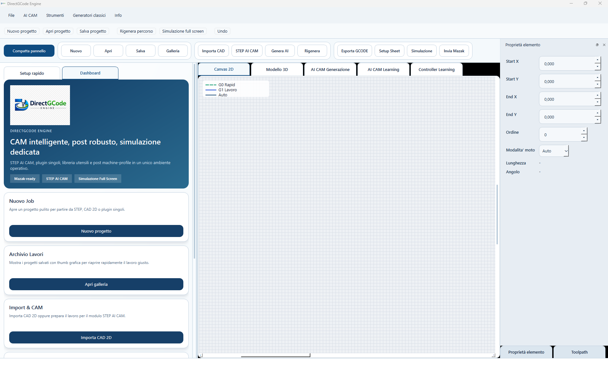
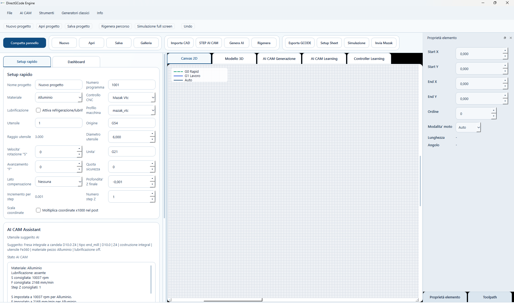
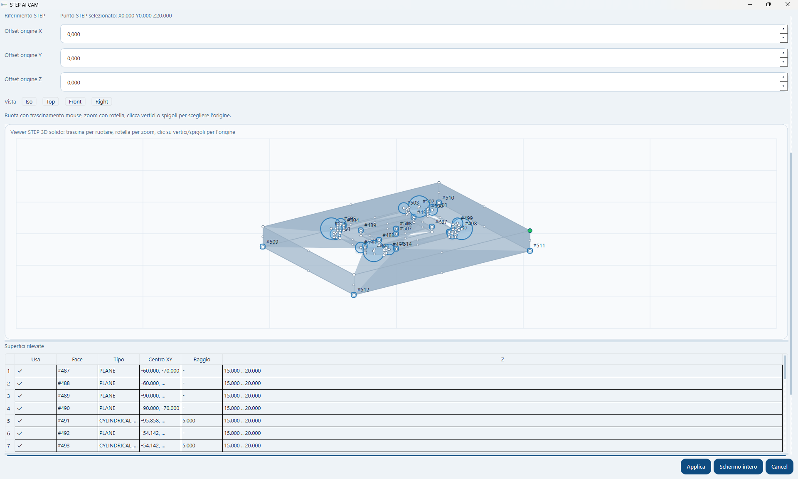
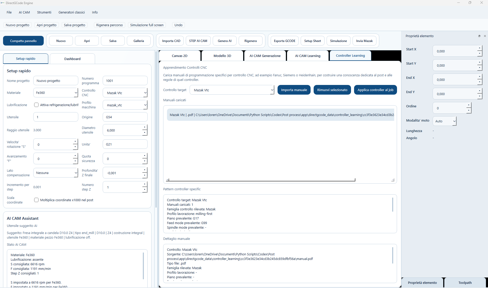

# DirectGCode Engine

**AI-driven Direct CAM for CNC machining**

DirectGCode Engine is a professional CAM software developed to generate G-code directly from simple machining inputs, reducing the need for traditional CAD/CAM workflows in many everyday CNC applications.

---

## Overview

In many real production environments, CNC programming does not always justify the complexity, cost and learning curve of traditional CAD/CAM systems.

DirectGCode Engine was created to fill this gap.

It is designed for companies and technical departments that need to generate machining programs quickly, reliably and with a more direct workflow, especially when they do not have dedicated CAM specialists or when the machining scope does not require a full advanced CAM environment.

---

## Vision

The core idea behind DirectGCode Engine is simple:

- reduce the distance between machining intent and machine-ready G-code
- simplify CNC programming for practical industrial use
- integrate AI-assisted logic to accelerate and improve CAM generation
- create a modular platform that can evolve with new machining strategies, controller logic and post-processing capabilities

---

## Main Concept

DirectGCode Engine is not intended to replace every advanced high-end CAM platform.

Its purpose is different:

- make CAM generation faster
- reduce complexity
- support practical machining needs
- provide a direct workflow from part definition to G-code output

The software combines:

- direct operation setup
- STEP-based workflows
- AI CAM generation
- learned machining cases
- controller-specific logic
- post-processing and simulation tools

---

## Key Features

### Direct CAM workflow
The software allows users to define machining operations in a more direct way, without depending entirely on a traditional CAD-first workflow.

### STEP to CAM
Import STEP files and derive machining information from geometry and detected surfaces.

### AI CAM Generation
Generate machining strategies starting from:

- STEP geometry
- textual descriptions
- manually defined parameters

### AI Learning System
The software can recall previously learned machining cases and apply similar strategies to new jobs.

### Controller Learning
Controller-specific documentation and patterns can be loaded to adapt generation logic to different CNC targets such as Mazak, Fanuc, Siemens and others.

### Integrated Post Processing
The system is designed to support robust post-processing logic and machine-oriented code output.

### Simulation and Validation
Includes simulation-oriented workflow support to verify generated paths before production use.

### Modular Architecture
The platform is built with a modular mindset so that plugins, libraries, machining generators and post-processors can evolve over time.

---

## Typical Use Cases

DirectGCode Engine is designed for:

- small and medium workshops
- internal production departments
- companies with CNC machines but without dedicated CAM programmers
- technical service environments
- fast-turnaround machining scenarios
- practical industrial applications where simplicity and speed are critical

---

## Why It Matters

Traditional CAM systems are often:

- expensive
- time-consuming to configure
- over-dimensioned for simple tasks
- dependent on experienced CAM users

DirectGCode Engine aims to provide a more accessible and practical alternative for a specific and often overlooked segment of the market.

---

## Current Functional Areas

The current project includes development around the following areas:

- project dashboard
- setup rapido
- STEP AI CAM
- AI CAM generation
- AI CAM learning
- controller learning
- G-code export
- setup sheet generation
- simulation environment
- toolpath generation workflow

---

## Interface Preview

### Main dashboard
The dashboard provides direct access to the project workflow, setup, AI CAM generation and machining tools.

### STEP AI CAM setup
The STEP-based workflow allows configuration of machining parameters, stock definition, origin logic and direct AI CAM preparation.

### STEP surface analysis
Detected surfaces and geometric references can be used to support AI-assisted machining generation.

### Controller learning
The software can load controller-oriented documentation and derive controller-specific rules and programming patterns.

---

## Development Status

DirectGCode Engine is currently under active development and refinement.

At this stage, the repository is intended as a **project showcase** and product presentation, not as a public source distribution of the full software engine.

---

## Repository Scope

This repository contains:

- public project presentation
- screenshots
- demo materials
- product overview
- non-sensitive technical documentation

This repository does **not** contain the proprietary core source code of the application.

---

## Roadmap

Planned development directions include:

- expanded AI CAM optimization
- extended tool libraries
- stronger controller-specific intelligence
- broader machining strategy coverage
- improved simulation and validation
- licensing and product delivery model
- commercial release preparation

---

## Commercial Direction

DirectGCode Engine is being developed as a commercial software product.

The long-term objective is to make it available under license as a professional software solution for companies looking for a faster and more direct CAM workflow.

---

## Contact

For collaboration, early access or product interest:

📧 lorenzo.marsico@gmail.com  
🔗 LinkedIn: https://www.linkedin.com/in/lorenzo-marsico

---

## Legal Notice

All rights reserved.

This repository is for presentation purposes only.  
The software core, AI modules, machining logic, post-processing logic and internal implementation details are proprietary and are not publicly distributed.

---

## Author

**Lorenzo Marsico**  
DirectGCode Engine Project
